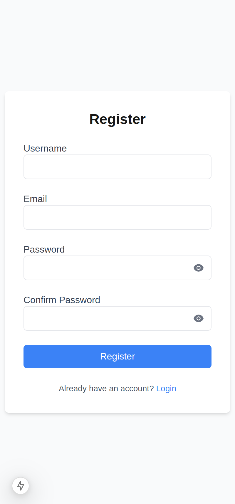
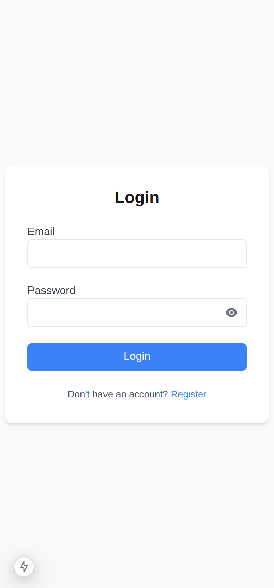
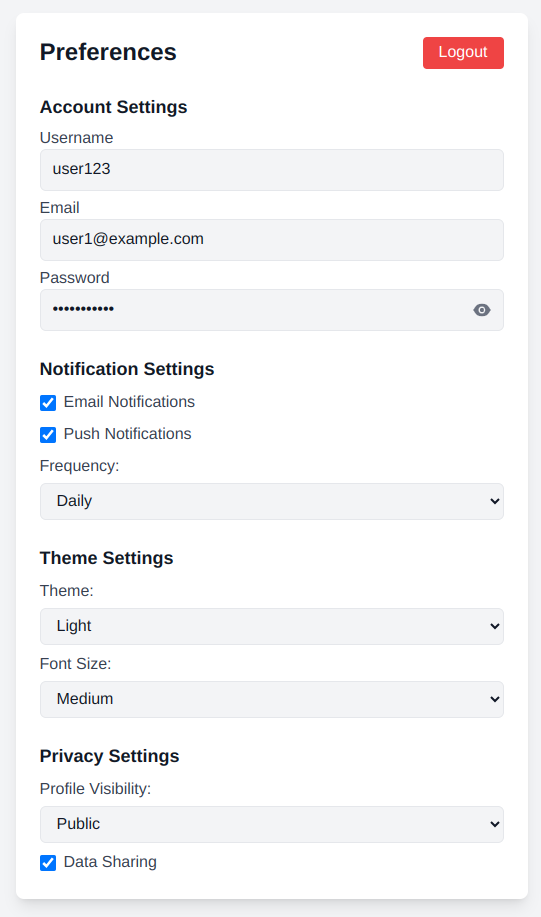
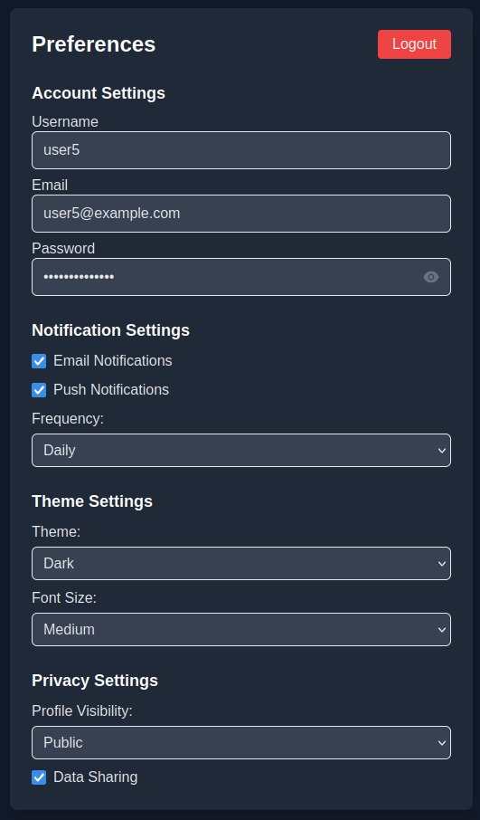
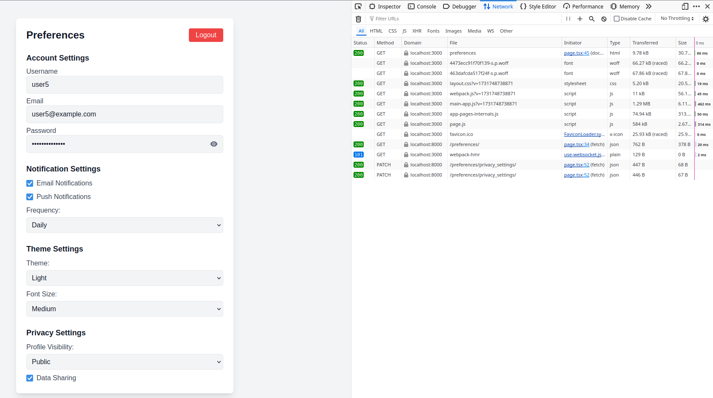

## Description

The frontend provides a user interface for registration, login, and managing user preferences. It supports dark mode and offers a responsive design.

## Installation Steps
1. Install the dependencies:

```sh
npm install
```

2. Start the development server:

```sh
npm run dev
```

3. Open your browser and navigate to `http://localhost:3000`.

### Register Page


### Login Page


### Preferences Page


### Dark Mode


### Network Tab
